本项目系安徽财经大学大数据与人工智能教师武凌指导的大数据实时热搜项目


# 效果展示图

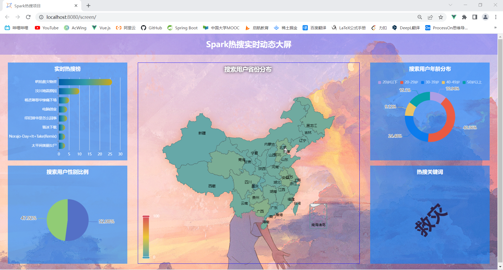


# spark数据入库操作

## 启动zookeeper集群

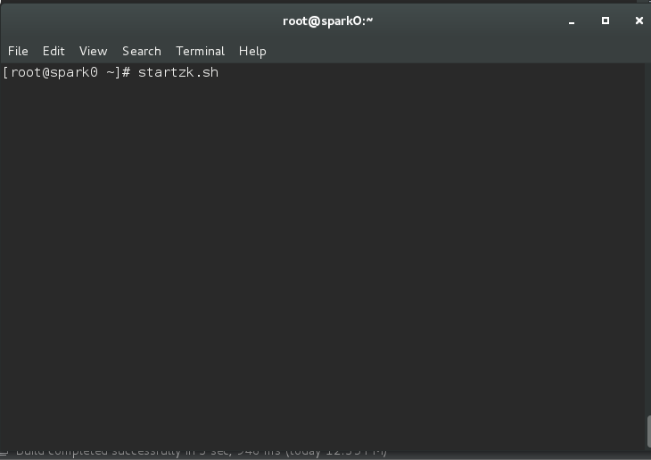

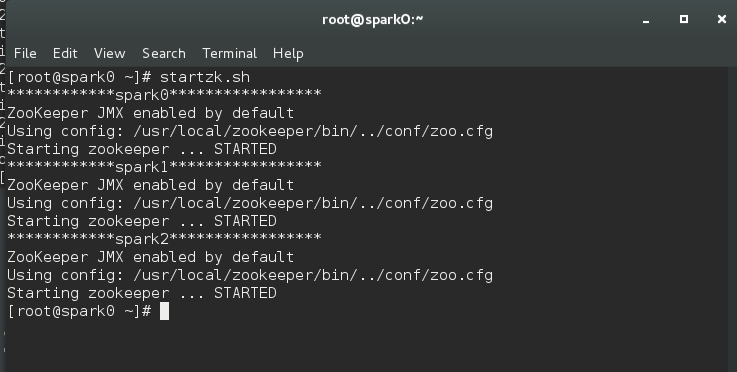

## 启动kafaka集群

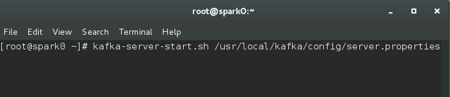

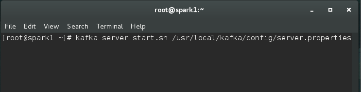

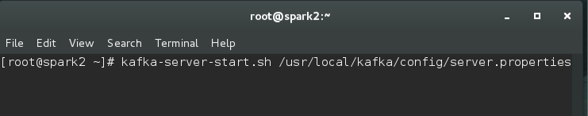


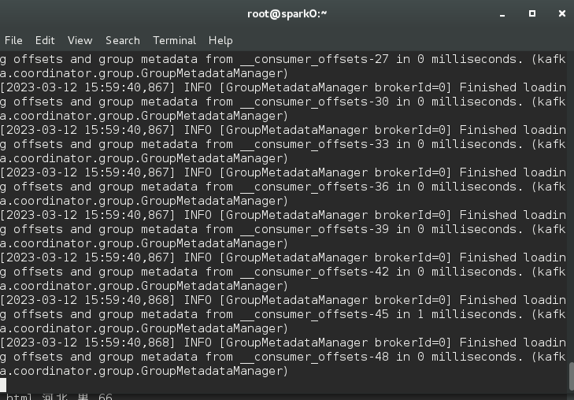

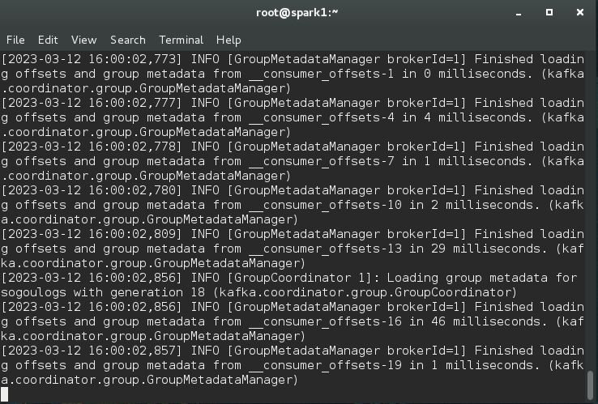

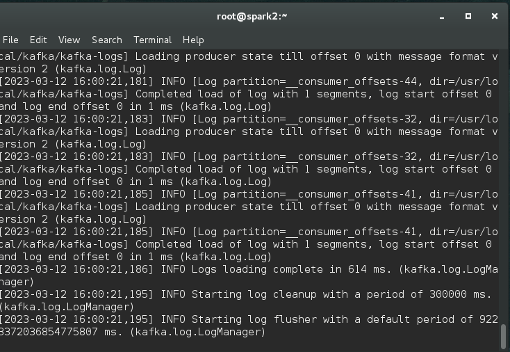

## 运行scala代码

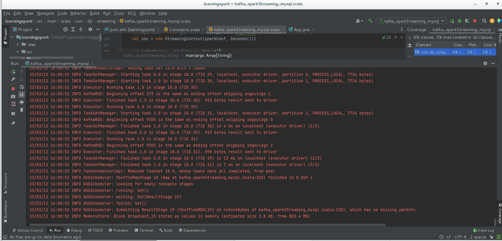

## 启动flume集群

先运行spark1和spark2上的

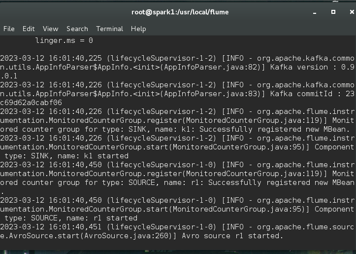

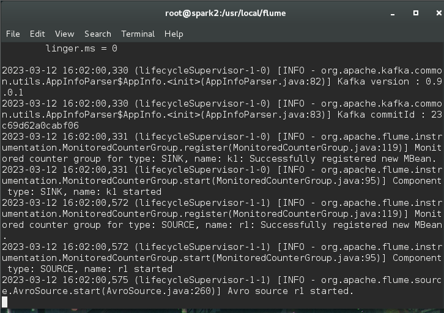

再运行spark0上的

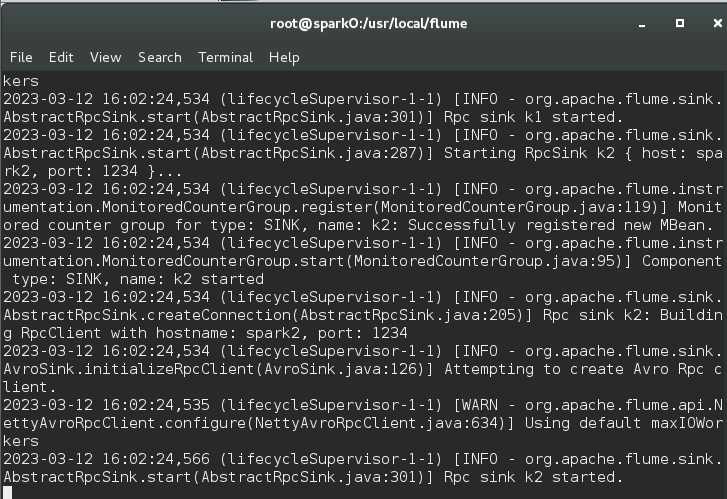


## 执行log脚本文件

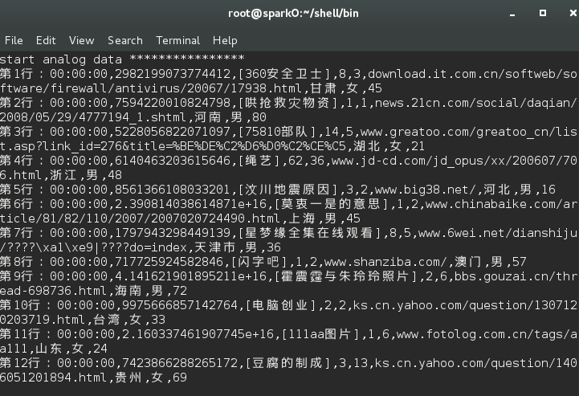

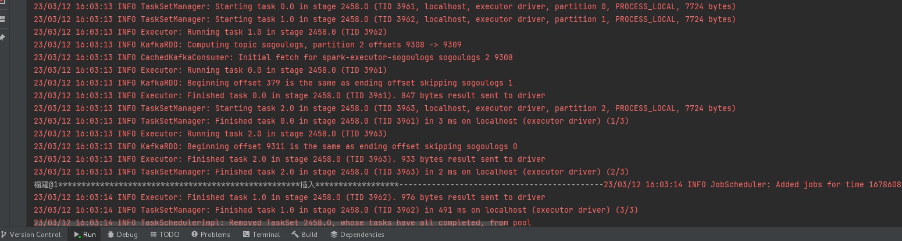

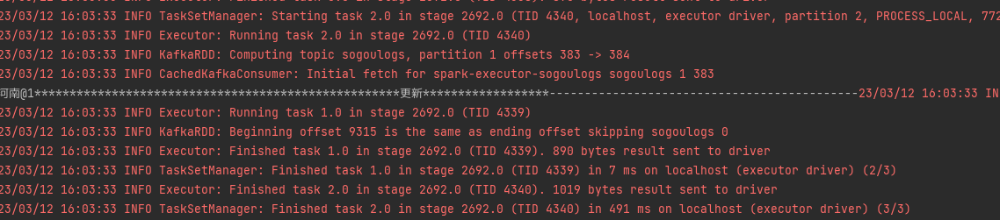

可以看见，已有数据开始入库，并打印了信息在控制台

# 启动SpringBoot+Vue

## 启动SpringBoot

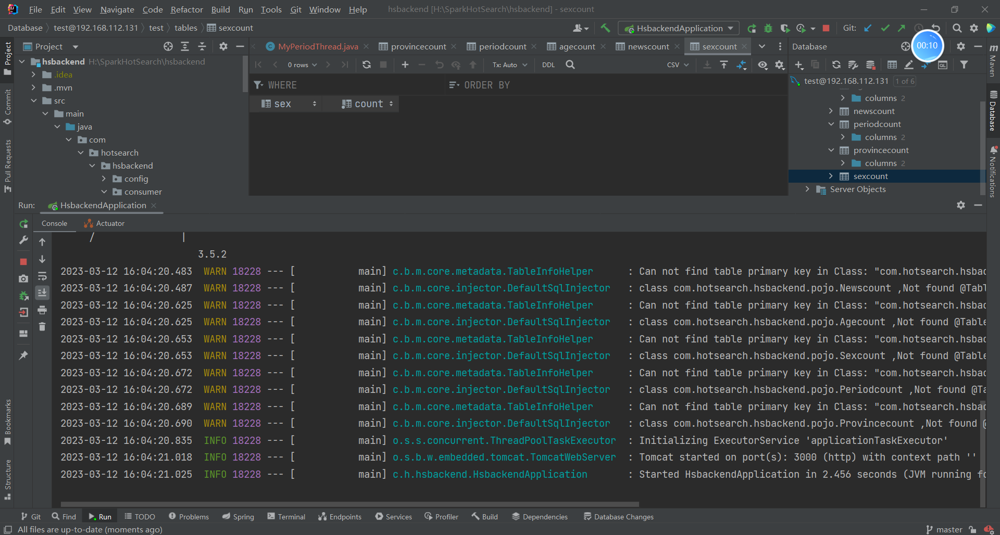


## 启动Vue

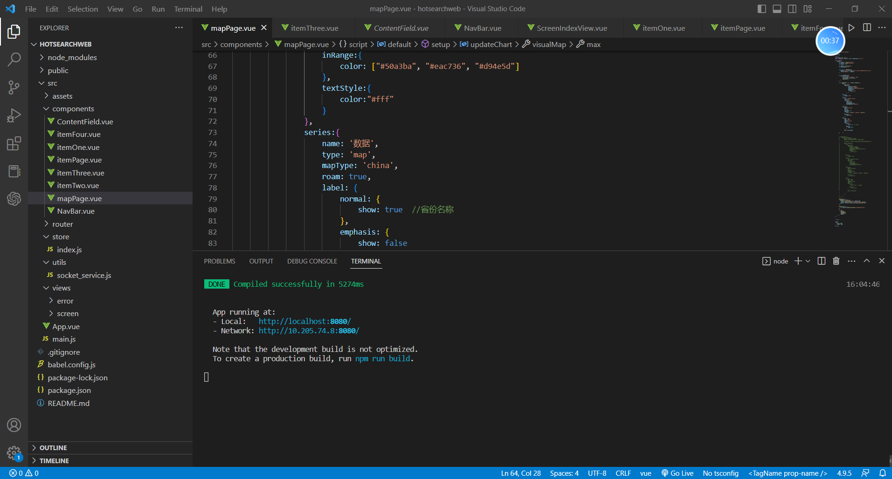

## 最终效果

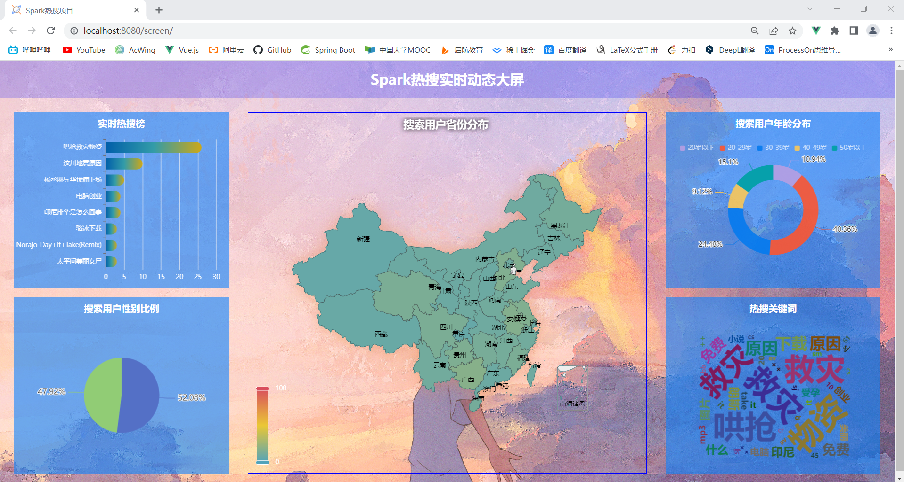


可以实时更新数据


# 数据库设计

5张数据表

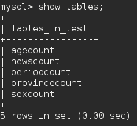

agecount：年龄统计

newscount：新闻统计

periodcount：时期统计

provincecount：省份统计

sexcount：性别统计


# Scala代码

新的spark代码

```scala

import org.apache.spark.SparkConf
import org.apache.spark.streaming.{Seconds, StreamingContext}
import java.sql.Connection
import java.sql.Statement
import java.sql.DriverManager
import org.apache.kafka.common.serialization.StringDeserializer
import org.apache.spark.streaming.kafka010._
import org.apache.spark.streaming.kafka010.LocationStrategies.PreferConsistent
import org.apache.spark.streaming.kafka010.ConsumerStrategies.Subscribe

/**
 * flume+kafka+Spark Streaming+mysql集成开发
 */
object kafka_sparkStreaming_mysql {

  /**
   * 新闻浏览量数据插入mysql
   */
  def myFun(records:Iterator[(String,Int)]): Unit = {
    var conn:Connection = null
    var statement:Statement = null

    try{
      val url = Constants.url
      val userName:String = Constants.userName
      val passWord:String = Constants.passWord

      //conn长连接
      conn = DriverManager.getConnection(url, userName, passWord)

      records.foreach(t => {

        val name = t._1.replaceAll("[\\[\\]]", "")
        val count = t._2
        print(name+"@"+count+"***********************************")

        val sql = "select 1 from newscount "+" where name = '"+name+"'"

        val updateSql = "update newscount set count = count+"+count+" where name ='"+name+"'"

        val insertSql = "insert into newscount(name,count) values('"+name+"',"+count+")"
        //实例化statement对象
        statement = conn.createStatement()

        //执行查询
        val resultSet = statement.executeQuery(sql)

        if(resultSet.next()){
          print("*****************更新******************")
          statement.executeUpdate(updateSql)
        }else{
          print("*****************插入******************")
          statement.execute(insertSql)
        }

      })
    }catch{
      case e:Exception => e.printStackTrace()
    }finally{
      if(statement !=null){
        statement.close()
      }

      if(conn !=null){
        conn.close()
      }

    }

  }
  /**
   * 性别数据插入mysql
   */
  def myFun3(records:Iterator[(String,Int)]): Unit = {
    var conn:Connection = null
    var statement:Statement = null

    try{
      val url = Constants.url
      val userName:String = Constants.userName
      val passWord:String = Constants.passWord

      //conn长连接
      conn = DriverManager.getConnection(url, userName, passWord)

      records.foreach(t => {

        val sex = t._1
        val count = t._2
        print(sex+"@"+count+"***********************************")

        val sql = "select 1 from sexcount "+" where sex = '"+sex+"'"

        val updateSql = "update sexcount set count = count+"+count+" where sex ='"+sex+"'"

        val insertSql = "insert into sexcount(sex,count) values('"+sex+"',"+count+")"
        //实例化statement对象
        statement = conn.createStatement()

        //执行查询
        val resultSet = statement.executeQuery(sql)

        if(resultSet.next()){
          print("*****************更新******************")
          statement.executeUpdate(updateSql)
        }else{
          print("*****************插入******************")
          statement.execute(insertSql)
        }

      })
    }catch{
      case e:Exception => e.printStackTrace()
    }finally{
      if(statement !=null){
        statement.close()
      }

      if(conn !=null){
        conn.close()
      }

    }

  }
  /**
   * 省份数据插入mysql
   */
  def myFun4(records:Iterator[(String,Int)]): Unit = {
    var conn:Connection = null
    var statement:Statement = null

    try{
      val url = Constants.url
      val userName:String = Constants.userName
      val passWord:String = Constants.passWord

      //conn长连接
      conn = DriverManager.getConnection(url, userName, passWord)

      records.foreach(t => {

        val province = t._1
        val count = t._2
        print(province+"@"+count+"***********************************")

        val sql = "select 1 from provincecount "+" where province = '"+province+"'"

        val updateSql = "update provincecount set count = count+"+count+" where province ='"+province+"'"

        val insertSql = "insert into provincecount(province,count) values('"+province+"',"+count+")"
        //实例化statement对象
        statement = conn.createStatement()

        //执行查询
        val resultSet = statement.executeQuery(sql)

        if(resultSet.next()){
          print("*****************更新******************")
          statement.executeUpdate(updateSql)
        }else{
          print("*****************插入******************")
          statement.execute(insertSql)
        }

      })
    }catch{
      case e:Exception => e.printStackTrace()
    }finally{
      if(statement !=null){
        statement.close()
      }

      if(conn !=null){
        conn.close()
      }

    }

  }
  /**
   * 年龄数据插入mysql
   */
  def myFun5(records:Iterator[(String,Int)]): Unit = {
    var conn:Connection = null
    var statement:Statement = null

    try{
      val url = Constants.url
      val userName:String = Constants.userName
      val passWord:String = Constants.passWord

      //conn长连接
      conn = DriverManager.getConnection(url, userName, passWord)

      records.foreach(t => {

        val age = t._1
        val count = t._2
        print(age+"@"+count+"***********************************")

        val sql = "select 1 from agecount "+" where age = '"+age+"'"

        val updateSql = "update agecount set count = count+"+count+" where age ='"+age+"'"

        val insertSql = "insert into agecount(age,count) values('"+age+"',"+count+")"
        //实例化statement对象
        statement = conn.createStatement()

        //执行查询
        val resultSet = statement.executeQuery(sql)

        if(resultSet.next()){
          print("*****************更新******************")
          statement.executeUpdate(updateSql)
        }else{
          print("*****************插入******************")
          statement.execute(insertSql)
        }

      })
    }catch{
      case e:Exception => e.printStackTrace()
    }finally{
      if(statement !=null){
        statement.close()
      }

      if(conn !=null){
        conn.close()
      }

    }

  }
  /**
   * 时段浏览量数据插入mysql数据
   */
  def myFun2(records:Iterator[(String,Int)]): Unit = {
    var conn:Connection = null
    var statement:Statement = null

    try{
      val url = Constants.url
      val userName:String = Constants.userName
      val passWord:String = Constants.passWord

      //conn
      conn = DriverManager.getConnection(url, userName, passWord)

      records.foreach(t => {

        val logtime = t._1
        val count = t._2
        print(logtime+"@"+count+"***********************************")

        val sql = "select 1 from periodcount "+" where logtime = '"+logtime+"'"

        val updateSql = "update periodcount set count = count+"+count+" where logtime ='"+logtime+"'"

        val insertSql = "insert into periodcount(logtime,count) values('"+logtime+"',"+count+")"
        //实例化statement对象
        statement = conn.createStatement()

        //执行查询
        val resultSet = statement.executeQuery(sql)

        if(resultSet.next()){
          print("*****************更新******************")
          statement.executeUpdate(updateSql)
        }else{
          print("*****************插入******************")
          statement.execute(insertSql)
        }

      })
    }catch{
      case e:Exception => e.printStackTrace()
    }finally{
      if(statement !=null){
        statement.close()
      }

      if(conn !=null){
        conn.close()
      }

    }

  }
  def main(args: Array[String]): Unit = {
    // Create the context with a 1 second batch size
    val sparkConf = new SparkConf().setAppName("sogoulogs").setMaster("local[2]")
    val ssc = new StreamingContext(sparkConf, Seconds(1))

    val kafkaParams = Map[String, Object](
      "bootstrap.servers" -> "s0:9092,s1:9092,s2:9092",
      "key.deserializer" -> classOf[StringDeserializer],
      "value.deserializer" -> classOf[StringDeserializer],
      "group.id" -> "sogoulogs",
      "auto.offset.reset" -> "earliest",
      "enable.auto.commit" -> (true: java.lang.Boolean)
    )

    val topics = Array("sogoulogs")
    val stream = KafkaUtils.createDirectStream[String, String](
      ssc,
      PreferConsistent,
      Subscribe[String, String](topics, kafkaParams)
    )

    val lines = stream.map(record =>  record.value)

    //无效数据过滤；注意此处是逗号分隔符
    val filter = lines.map(_.split(",")).filter(_.length==9)

    //统计所有新闻话题浏览量
    val newsCounts = filter.map(x => (x(2), 1)).reduceByKey(_ + _)
    newsCounts.foreachRDD(rdd => {
      print("--------------------------------------------")
      //分区并行执行
      rdd.foreachPartition(myFun)
    })
    newsCounts.print()

    //统计性别数据
    val sexCounts = filter.map(x => (x(7), 1)).reduceByKey(_ + _)
    sexCounts.foreachRDD(rdd => {
      print("--------------------------------------------")
      //分区并行执行
      rdd.foreachPartition(myFun3)
    })

    //统计省份数据
    val provinceCounts = filter.map(x => (x(6), 1)).reduceByKey(_ + _)
    provinceCounts.foreachRDD(rdd => {
      print("--------------------------------------------")
      //分区并行执行
      rdd.foreachPartition(myFun4)
    })

    //统计年龄数据
    val ageCounts = filter.map(x => (x(8), 1)).reduceByKey(_ + _)
    ageCounts.foreachRDD(rdd => {
      print("--------------------------------------------")
      //分区并行执行
      rdd.foreachPartition(myFun5)
    })

    //统计所有时段新闻浏览量
    val periodCounts = filter.map(x => (x(0), 1)).reduceByKey(_ + _)
    periodCounts.print()

    periodCounts.foreachRDD(rdd =>{
      rdd.foreachPartition(myFun2)
    })

    ssc.start()
    ssc.awaitTermination()
  }
}

```


# 附录

任务分工

武老师：指导开发方向

钱同学：SpringBoot+Vue相关的Web代码编写

王同学：负责spark数据入库部分

张同学：提供了参考意见
